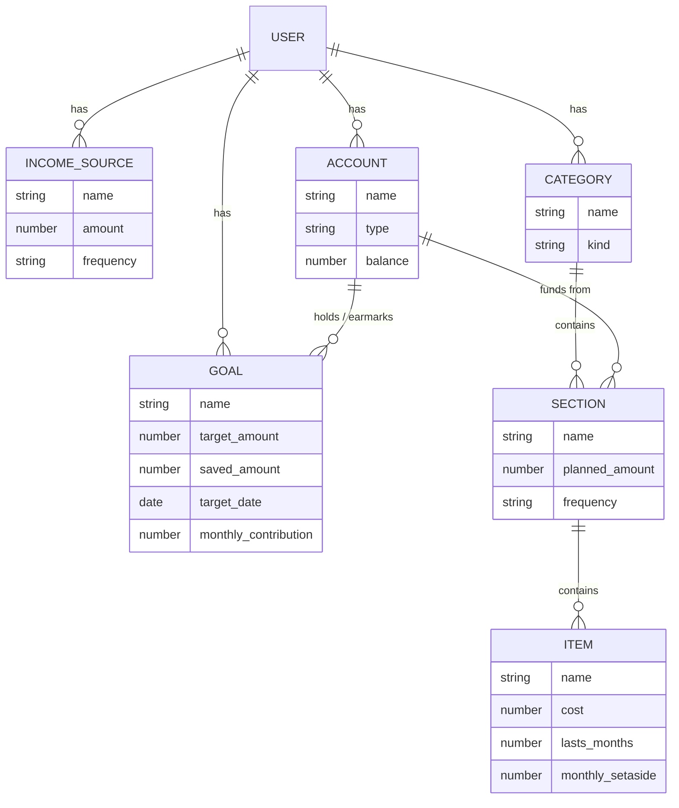
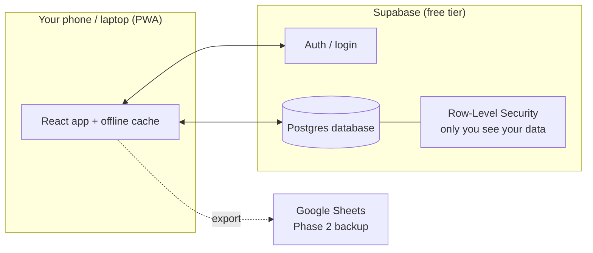

# Budget Buddy — Project Plan

*A personal budgeting app that plans your money, not just records it.*

Last updated: 13 July 2026

---

## 1. What we're building (and why it's different)

Most budget apps are **rear-view mirrors**: they connect to your bank and tell you what you *already* spent. Budget Buddy is a **planning tool**. It's not linked to your bank — you tell it your plan, and it does the maths to tell you:

- how much of each pay-cheque to set aside for everything, including things you only buy occasionally (like shampoo every 2nd month),
- where your money physically sits (which accounts) and how much of that is already promised vs. truly free,
- how to steadily kill debt with leftover money, and
- how long until you can afford the things you're saving for.

It's the difference between a diary and a game plan.

---

## 2. Decisions we locked in (plain English)

We grilled each choice; here's where we landed and why.

| Area | Decision | Why |
|---|---|---|
| **How it runs** | **PWA** — one web app that also "installs" to your phone's home screen | One codebase for phone + laptop; no app stores; plays to your React skills |
| **Framework** | **React + Vite** | Biggest ecosystem, most examples to copy, fast modern tooling |
| **Where data lives** | **Supabase** is the source of truth; **Google Sheets export** comes later | Free login + instant phone↔laptop sync, fits your nested structure; you still get a real spreadsheet in Drive in Phase 2 |
| **Budget rhythm** | **Monthly base**, with a **switchable weekly/monthly view** | Matches your monthly salary; you can still *see* things weekly |
| **Occasional items (shampoo)** | **Monthly set-aside maths only** (no running "jar" yet) | Keeps v1 simple; jar-tracking is an easy later add |
| **Accounts** | **Track balances + earmarks** | Shows what's in each account and how much is already spoken for |
| **Debt** | **Fixed amount + optional "sweep the leftover"** | Covers both ways you described paying down a card |
| **Savings goals** | **Both** deadline-driven and contribution-driven | Matches how people actually think about saving |
| **Google Sheets** | **Phase 2** | De-risks the project; get something usable fast |

---

## 3. The core idea, explained simply

Think of your month as a pizza (your income). Budget Buddy helps you slice it up *before* you eat any of it:

1. **Income** — one or more slices coming in (salary, side gigs). You can have several sources.
2. **Categories** — the big named slices: "Debit orders", "Weekly expenses", "Personal savings", "Debt". You can add and remove these freely.
3. **Sections** — smaller slices *inside* a category. "Weekly expenses" might hold *food*, *petrol*, *airtime*. You can add and remove these too.
4. **The clever bit — occasional items.** For something like shampoo (R60, lasts 2 months), you tell the app the cost and how long it lasts. It quietly works out "put away R30 every month" and folds that into your budget, so the money's ready when you need it. No nasty surprises.
5. **Accounts** — the real-world buckets (cheque, savings, cash). You type in each balance, and the app shows how much is **earmarked** (already promised to a goal or set-aside) vs. **free**.
6. **Debt** — a special category. Give it a fixed amount, *and/or* let the app sweep whatever's left after everything else onto it.
7. **Goals** — saving for a laptop or holiday. Tell it either a target date *or* a monthly amount, and it fills in the other half and tracks your progress.

Everything reconciles to one number: **"Is your plan balanced?"** (income = everything you've allocated). If you're over or under, the app shows it clearly.

---

## 4. Data model (how the pieces connect)

**In words:** You have income sources, accounts, categories, and goals. Categories contain sections; sections contain items (like shampoo). Accounts hold money and can be linked to goals/sections so the app knows *where* each planned rand lives. `kind` on a category marks special ones (e.g. `debt`). `frequency` is how we do the monthly↔weekly switch — everything is stored in one canonical rhythm and converted for display.

---

## 5. Tech stack

| Layer | Choice | What it does (ELI5) |
|---|---|---|
| **UI framework** | React 18 + Vite | The building blocks + the tool that assembles the app |
| **Language** | TypeScript | JavaScript with a spell-checker — catches mistakes as you type |
| **Styling** | Tailwind CSS | Style straight in the markup with small utility classes; fast to build |
| **Routing** | React Router | Moves you between screens (Dashboard, Categories, Accounts…) |
| **State/data fetching** | TanStack Query | Keeps the screen in sync with the database automatically |
| **Backend + DB + auth** | Supabase (Postgres) | The filing cabinet + the "sign in" system, on a free tier |
| **PWA** | vite-plugin-pwa | The magic that lets the site install to your phone + work offline |
| **Charts** | Recharts | The pie/bar charts on your dashboard |
| **Money maths** | dinero.js (or integer cents) | Avoids rounding bugs — money is handled exactly, never as sloppy decimals |
| **Phase 2** | Google OAuth + Google Sheets API | "Sign in with Google" + writing a backup spreadsheet to your Drive |

**Why Supabase over Google Sheets as the engine:** Sheets is built for humans typing in cells, not for an app reading/writing constantly. Supabase gives you a real database that fits your nested categories, free login, and automatic sync between your phone and laptop — while Phase 2 still delivers the "open it as a spreadsheet in Drive" feature you liked.

---

## 6. Architecture (how it fits together)

The app talks directly to Supabase — no separate server for you to run or pay for. "Row-Level Security" is a Supabase feature that guarantees each user only ever sees their own data. Phase 2 adds an export path to Google Sheets.

---

## 7. Roadmap (phased so you always have something working)

### Phase 0 — Foundations (setup)
- Create the React + Vite + TypeScript + Tailwind project.
- Set up Supabase project, database tables, and login.
- Get "sign up / log in" working end to end.
- Turn on PWA (installable + offline shell).

### Phase 1 — The budget engine (the MVP you'll actually use daily)
- **Income:** add/edit multiple income sources.
- **Categories & sections:** create, rename, delete categories; add/remove sections inside them.
- **Occasional items:** enter cost + how long it lasts → auto monthly set-aside folded into the budget.
- **Debt:** fixed amount + optional "sweep leftover" toggle.
- **Balance check:** the "is my plan balanced?" summary (income vs. allocated).
- **Monthly ⇄ weekly toggle** on the whole view.
- **Dashboard** with a simple breakdown chart.

### Phase 2 — Accounts, goals & Google Sheets
- **Accounts:** balances + earmarked-vs-free view.
- **Goals:** both deadline- and contribution-driven, with progress tracking.
- **Google Sheets export:** sign in with Google, write a backup snapshot to your Drive.

### Phase 3 — Nice-to-haves (later)
- Running "jar" tracking per occasional item (progress + next-purchase estimate).
- History / month-over-month trends.
- Multiple budget scenarios ("what if I earned R2k more?").
- Reminders/notifications.

---

## 8. Concrete next steps

1. **Confirm this plan** — tell me what to change.
2. **Set up the project skeleton** (Phase 0): I can scaffold the React + Vite + Tailwind app right here in `budget-buddy` and get it running.
3. **Create your free Supabase account** — I'll give you the exact table definitions to paste in, or we script them.
4. **Build Phase 1 screen by screen**, starting with income + categories, so you can start using it as soon as possible.

When you're ready, just say *"let's start building"* and I'll scaffold Phase 0.

---

## Appendix — Glossary (plain English)

- **PWA:** a website polished enough to install on your phone like an app and work offline.
- **Supabase:** a ready-made backend — database + login — you don't have to run yourself.
- **Sinking fund / set-aside:** saving a little each month for something you don't buy every month (shampoo, insurance).
- **Earmark:** money that's physically in an account but already promised to a goal or set-aside.
- **Leftover sweep:** automatically putting whatever's left at month-end toward a debt.
- **Canonical rhythm:** we store every amount in one base period (monthly) and convert to weekly only for display, so the numbers never disagree.
