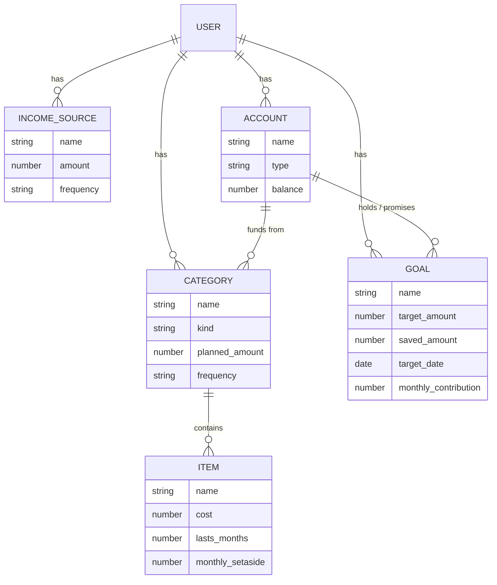

# Budget Buddy — Project Plan

*A budgeting app that plans your money, not just records it — clean, kind, and simple enough for anyone.*

Last updated: 15 July 2026

---

## 1. What we're building (and why it's different)

Most budget apps are **rear-view mirrors**: they connect to your bank and tell you what you *already* spent. Budget Buddy is a **planning tool**. It's not linked to your bank — you tell it your plan, and it does the maths to tell you:

- how much of each pay-cheque to set aside for everything, including things you only buy occasionally (like shampoo every 2nd month),
- where your money physically sits (which accounts) and how much of that is already promised vs. truly free,
- how to steadily kill debt with leftover money, and
- how long until you can afford the things you're saving for.

It's the difference between a diary and a game plan.

---

## 1a. Who it's for, and how it should feel

Budget Buddy is being built as a **real product for other people** — not just a personal tool. The people we design for are **older adults and anyone with no financial background**. Danielle is the first user, but every choice is made so that someone's grandmother, or someone who's never made a budget in their life, can pick it up and succeed on their own.

That goal drives four design principles that override everything else:

1. **Plain language, always.** No finance jargon. We never say "sinking fund," "earmark," or "reconcile." We say "things I buy now and then," "money with a job," and "does your plan add up?" If a word needs explaining, we change the word.
2. **Clean and quietly delightful.** The default screen is calm and minimal — money in, money out, are you okay? "Fun" here means it feels *kind and reassuring*, with small satisfying moments (a gentle tick when your plan balances, a warm "You're on track!"), not bright mascots or busy animation. Trust comes first because it's money.
3. **Accessible to the standard, and beyond it for older eyes.** We commit to **WCAG 2.2 AA**, plus opinionated elder-friendly defaults: large base text (18px+), a one-tap "bigger text" switch, high contrast, tap targets of 44px or more, and never relying on colour alone to convey meaning.
4. **Works everywhere.** Fully responsive — comfortable on a phone held in one hand and on a laptop — as a PWA. Same app, same account, laid out well for whatever screen you're on.

### Nobody starts from a blank page

Because our users have never budgeted, the first run is a **short, friendly guided setup**: it asks a few plain questions ("What do you earn a month?", "What do you usually spend money on?") and pre-fills a **starter budget** with sensible South African categories (Food, Transport, Airtime, Electricity…) that they can keep or change. They reach a finished, working budget without needing to know how budgeting works.

---

## 2. Decisions we locked in (plain English)

We grilled each choice; here's where we landed and why.

| Area | Decision | Why |
|---|---|---|
| **Who it's for** | **A real product for others** — older adults & finance-newbies; Danielle is user #1 | Raises the bar on simplicity, onboarding, and accessibility — the whole point of the redesign |
| **Feel / tone** | **Clean & quietly delightful** — calm and minimal, with small warm moments | Trust matters most for a money app; playful/busy would undermine it and hurt accessibility |
| **Language** | **Plain words, no jargon** — ever | Users have no financial background; the words are the product |
| **Accessibility** | **WCAG 2.2 AA + elder-friendly defaults** (18px+ text, bigger-text switch, high contrast, 44px+ targets, never colour-only) | Credible, achievable standard, tuned for older eyes |
| **Onboarding** | **Guided setup wizard + starter template** | Nobody faces a blank page; a newbie reaches a finished budget by answering a few questions |
| **How it runs** | **PWA**, fully responsive (phone + laptop) | One codebase for both; no app stores; installable |
| **Framework** | **React + Vite** | Biggest ecosystem, most examples to copy, fast modern tooling |
| **Sign-in** | **Sign in with Google** (Google OAuth) | One tap, no password to forget; also grants the access we need to store data in the user's own Sheet |
| **Where data lives** | **The user's own Google Sheet**, in their Google Drive — the app runs no database at all | Maximum data-ownership: the user owns their data, we store nothing. Trade-off accepted: requires a Google account, and Sheets API limits mean we cache and batch carefully |
| **Budget rhythm** | **Monthly base**, with a **switchable weekly/monthly view** | Matches a monthly salary; you can still *see* things weekly |
| **Model shape** | **Flat categories** (Category → Item; the middle "Section" layer is dropped) | One less level to learn; less nesting to get lost in |
| **Occasional items** | **Monthly set-aside maths**, called *"things I buy now and then"* (running "jar" later) | The unique, differentiating feature — kept, but de-jargoned; jar-tracking is an easy later add |
| **Accounts** | **Balances + "money with a job" vs "free to spend"** | The old "earmark" concept, kept in full but shown in plain words |
| **Goals** | **Both** deadline-driven and contribution-driven, with a simple progress bar | Matches how people actually think about saving; newbies understand progress bars |
| **Debt** | **Fixed amount** for v1 (the "sweep the leftover" option is deferred) | Sweep is the confusing bit for a newcomer; easy to add back later |
| **Privacy (POPIA)** | **Very light footprint** — we store no financial data on any server; it lives in the user's Drive. We still show a clear consent screen (what Google access we ask for and why), a privacy policy, and a one-tap "disconnect & delete the sheet" | The store-nothing design is the strongest possible privacy answer; consent for the Google scopes is the main obligation left |
| **Data access scope** | **`drive.file`** — the app can only touch the single spreadsheet it creates, nothing else in the user's Drive | Least-privilege; reassuring for users and avoids Google's heavier restricted-scope review |

---

## 3. The core idea, explained simply

Think of your month as a pizza (your income). Budget Buddy helps you slice it up *before* you eat any of it:

1. **Income** — one or more slices coming in (salary, side gigs). You can have several.
2. **Categories** — the named slices you spend on: "Food", "Transport", "Airtime", "Debt". You add, rename, and remove these freely, and give each one a planned amount. (There's no deeper nesting to get lost in — the old "Section" layer has been removed.)
3. **The clever bit — things I buy now and then.** For something like shampoo (R60, lasts 2 months), you tell the app the cost and how long it lasts. It quietly works out "put away R30 every month" and folds that into your budget, so the money's ready when you need it. No nasty surprises — and we never call it a "sinking fund".
4. **Accounts** — the real-world buckets (cheque, savings, cash). You type in each balance, and the app shows, in plain words, how much is **"money with a job"** (already promised to a goal or a set-aside) vs. **"free to spend"**.
5. **Debt** — a category you pay a fixed amount toward each month. (A smarter "sweep whatever's left onto the debt" option is planned for later.)
6. **Goals** — saving for a laptop or holiday. Tell it either a target date *or* a monthly amount, it fills in the other half, and it shows a friendly progress bar.

Everything comes back to one plain question: **"Does your plan add up?"** (money coming in = everything you've planned for). If you're over or under, the app shows it clearly and kindly.

---

## 4. Data model (how the pieces connect)



**In words:** You have income sources, accounts, categories, and goals. Categories hold their own planned amount and can contain "things I buy now and then" items (like shampoo) — there's no middle "section" layer any more. Accounts hold money and can be linked to goals/categories so the app knows *where* each planned rand lives and how much is "money with a job" vs "free to spend". `kind` on a category marks special ones (e.g. `debt`). `frequency` is how we do the monthly↔weekly switch — everything is stored in one canonical rhythm (monthly) and converted for display.

**How this lives in a Google Sheet:** because there's no database, each entity above becomes a **tab** in the user's spreadsheet — `Income`, `Categories`, `Items`, `Accounts`, `Goals`, plus a small hidden `Meta` tab for version/settings. Each row is one record; the first row of each tab is the column headers. Relationships (which item belongs to which category, which goal sits in which account) are stored as simple ID references in a column, exactly as they would be in database tables. The app reads all tabs on load, keeps the data in memory, and writes changes back in batches (see the rate-limit note in §5). Because the sheet lives in the user's own Drive, only they (and the app, via the `drive.file` scope) can see it — no server-side access rules needed.

---

## 5. Tech stack

| Layer | Choice | What it does (ELI5) |
|---|---|---|
| **UI framework** | React 18 + Vite | The building blocks + the tool that assembles the app |
| **Language** | TypeScript | JavaScript with a spell-checker — catches mistakes as you type |
| **Styling** | Tailwind CSS | Style straight in the markup with small utility classes; fast to build |
| **Routing** | React Router | Moves you between screens (Dashboard, Categories, Accounts…) |
| **State/data fetching** | TanStack Query | Keeps the screen in sync with the sheet and manages caching/retries automatically |
| **Sign-in** | Google Identity Services (OAuth 2.0, PKCE) | "Sign in with Google" — one tap, no password; also authorises Sheets/Drive access |
| **Data store** | The user's own **Google Sheet** (Google Sheets API v4) + **Drive API** with `drive.file` scope | No database we run; the app creates and reads/writes one spreadsheet in the user's Drive |
| **Local cache / offline** | IndexedDB (via a small wrapper) + a write queue | Holds the last-loaded data so the app opens instantly and can queue edits when offline, flushing to the sheet when back online |
| **Accessibility** | Radix UI / Headless UI + a theme with large-text & high-contrast modes | Components that are keyboard- and screen-reader-ready out of the box, so we hit WCAG 2.2 AA |
| **PWA** | vite-plugin-pwa | The magic that lets the site install to your phone + work offline |
| **Charts** | Recharts (with non-colour labels/patterns) | The dashboard charts — always labelled, never colour-only |
| **Money maths** | dinero.js (or integer cents) | Avoids rounding bugs — money is handled exactly, never as sloppy decimals |

**Why Google-only (auth + Sheets):** the user signs in with Google, and their budget lives in a spreadsheet in *their* Google Drive — we run no server and store none of their data. That's the strongest possible answer to privacy: they own their data and can open it as a normal spreadsheet any time. The deliberate trade-offs, and how we handle them:

- **Everyone needs a Google account.** This is the one accessibility compromise; we lean on Google's own familiar, accessible sign-in to soften it.
- **Sheets isn't a database.** The Sheets API allows roughly 60 read + 60 write requests per user per minute. We stay well under this by reading all tabs once on load, keeping everything in memory, and writing changes back in **debounced batches** (`values.batchUpdate`) rather than on every keystroke.
- **Offline is harder.** We cache the last snapshot in IndexedDB so the app always opens, and queue any edits to sync when the connection returns.
- **Least privilege.** The `drive.file` scope means the app can only see the one spreadsheet it created — nothing else in the user's Drive.

---

## 6. Architecture (how it fits together)

```mermaid
flowchart LR
    subgraph Device["Your phone / laptop (PWA, fully responsive)"]
        UI[React app]
        Cache[(IndexedDB cache<br/>+ write queue)]
        UI <--> Cache
    end
    GID[Google Identity<br/>Sign in with Google]
    subgraph GDrive["The user's own Google Drive"]
        Sheet[[Budget Buddy sheet<br/>Income / Categories / Items /<br/>Accounts / Goals tabs]]
    end

    UI <-->|"OAuth 2.0 (PKCE)"| GID
    GID -. access token<br/>drive.file scope .-> UI
    UI <-->|"Sheets API<br/>batched reads/writes"| Sheet
```

The user signs in with Google, which hands the app a short-lived access token scoped to just the one spreadsheet (`drive.file`). The app reads all tabs on load into an in-memory + IndexedDB cache so it opens instantly, and writes changes back to the sheet in batches. There's **no server we run and no database** — the data lives entirely in the user's own Drive.

---

## 7. Roadmap (phased so you always have something working)

Accessibility, plain language, and the clean/kind feel are **not a phase** — they're baked into every screen from the first one. The design-system foundation below makes that automatic rather than a bolt-on.

### Phase 0 — Foundations (setup)
- Create the React + Vite + TypeScript + Tailwind project.
- **Design-system foundation:** accessible component base (Radix/Headless UI), a theme hitting WCAG 2.2 AA, 18px+ base text, a one-tap "bigger text" switch, high-contrast palette, 44px+ tap targets. Responsive layout shell for phone + laptop.
- Set up a Google Cloud project: enable the Sheets + Drive APIs, configure the OAuth consent screen (with the `drive.file` scope), get client credentials.
- **Sign in with Google** working end to end, with a plain-language consent screen explaining what access we ask for and why.
- **Sheet bootstrapping:** on first sign-in, create the "Budget Buddy" spreadsheet in the user's Drive with the tab/column schema; remember its file ID for next time.
- **Data layer:** read-all-on-load into an IndexedDB cache, in-memory model, and debounced batched writes back to the sheet.
- Turn on PWA (installable + offline shell that opens from cache).
- **Privacy basics:** consent screen, a privacy policy, and a one-tap "disconnect & delete my sheet".

### Phase 1 — The budget engine (the MVP, usable by a total newcomer)
- **Guided setup wizard + starter template:** a few plain questions that pre-fill sensible SA starter categories, so a first-timer reaches a finished budget.
- **Income:** add/edit multiple income sources.
- **Categories:** create, rename, delete flat categories, each with a planned amount (no "section" nesting).
- **Things I buy now and then:** enter cost + how long it lasts → auto monthly set-aside folded into the budget.
- **Debt:** fixed monthly amount.
- **"Does your plan add up?"** summary (income vs. planned), shown clearly and kindly.
- **Monthly ⇄ weekly toggle** on the whole view.
- **Dashboard** with a simple, labelled breakdown chart and a warm "on track" moment.

### Phase 2 — Accounts & goals
- **Accounts:** balances with the plain-language "money with a job" vs "free to spend" view.
- **Goals:** both deadline- and contribution-driven, with a friendly progress bar.
- **"Open my spreadsheet":** a one-tap link to the underlying Google Sheet, so power users can view/edit their data directly (it was always in their Drive — this just surfaces it nicely).

### Phase 3 — Nice-to-haves (later)
- **Debt "sweep the leftover"** option (auto-apply what's left at month-end).
- Running "jar" tracking per occasional item (progress + next-purchase estimate).
- History / month-over-month trends.
- Multiple budget scenarios ("what if I earned R2k more?").
- Reminders/notifications.

---

## 8. Concrete next steps

1. **Confirm this plan** — tell me what to change.
2. **Set up the project skeleton** (Phase 0): I can scaffold the React + Vite + Tailwind app right here in `budget-buddy`, with the accessible design-system foundation from day one, and get it running.
3. **Set up a Google Cloud project** — I'll walk you through enabling the Sheets + Drive APIs, configuring the OAuth consent screen with the `drive.file` scope, and getting the client credentials the app needs.
4. **Build the data layer + Google sign-in**, then Phase 1 screen by screen, starting with the guided setup + income + categories, so a real person could use it as soon as possible.

When you're ready, just say *"let's start building"* and I'll scaffold Phase 0.

---

## Appendix — Glossary (plain English)

*(These are here for us as builders. The app itself never shows these words to users — the plain-language version is in brackets.)*

- **PWA:** a website polished enough to install on your phone like an app and work offline.
- **Google OAuth / Google Identity:** the "Sign in with Google" system; it also asks the user's permission for the app to work with a spreadsheet in their Drive.
- **`drive.file` scope:** a narrow permission that lets the app touch only the one spreadsheet it created — nothing else in the user's Drive.
- **Google Sheets API:** how the app reads and writes the user's budget spreadsheet.
- **IndexedDB:** a small in-browser store where we cache the last-loaded data so the app opens instantly and can work offline.
- **Batched / debounced writes:** instead of saving on every keystroke, we bundle changes and send them together, to stay under the Sheets API rate limits.
- **WCAG 2.2 AA:** the recognised accessibility standard we build to (contrast, keyboard use, screen-reader support, etc.).
- **Sinking fund / set-aside** *(shown as "things I buy now and then")*: saving a little each month for something you don't buy every month (shampoo, insurance).
- **Earmark** *(shown as "money with a job" vs "free to spend")*: money that's physically in an account but already promised to a goal or set-aside.
- **Leftover sweep** *(Phase 3)*: automatically putting whatever's left at month-end toward a debt.
- **Canonical rhythm:** we store every amount in one base period (monthly) and convert to weekly only for display, so the numbers never disagree.
